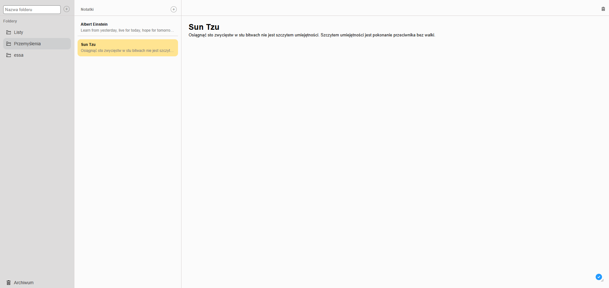

# Note App React

Note app created in react using react-router-dom and json server. This project it's a part of [zrozumieć-react.pl](https://zrozumiecreact.pl/) course.
<br><br>
<b>WARNING! The backend server is running on a free version of Render web service so the landing time of the site and images may be longer please be patient.</b> .

## Demo

https://note-app-szafter12.netlify.app/

## Run Locally

Clone the project

```bash
  git clone https://github.com/Szafter12/Note-app.git
```

Go to the project directory

```bash
  cd Note-app
```

Install dependencies

```bash
  npm install
```

Start the server

```bash
  npm run dev
```


## Features

- Adding folders
- Adding new notes
- Modify existing notes
- Deleting notes 
- Archive folder for delete notes

## Appendix

Application isn't responsive I will change it soon
Anyone can add a note so I am not responsible for what is found there.

## Tech Stack

- React (React-router, CSS Modules)
- JSON server
- Vite

## Authors

- [@Jakub Pachut](https://github.com/Szafter12)
